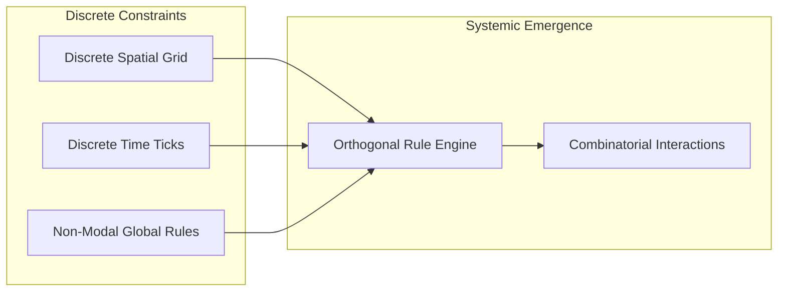
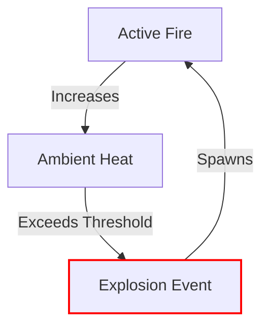

# Chapter 1: The Anatomy of Emergence in Roguelikes

> *"Emergence is what happens when an author designs the rules of a world rather than the story that takes place within it."*

---

## 1.1 The Berlin Interpretation Revisited

In 2008, the International Roguelike Development Conference formulated the **Berlin Interpretation**, outlining high-value factors that historically defined the genre:
* Grid-based discrete spatial movement
* Turn-based discrete time simulation
* Procedural generation of environments and items
* Permadeath (consequential mortality)
* Non-modal interaction (all actions—movement, inventory, combat, magic—occur within the same overarching game interface)

While these rules were formulated as descriptive history, they contain a profound, hidden software architectural virtue: **they establish a discrete, deterministic laboratory for combinatorial systems**.



Continuous 3D physics engines (e.g. Havok, PhysX) must fight floating-point drift, tunneling, numerical instability, and clipping errors. In contrast, a discrete grid and a turn-based tick scheduler provide a mathematical sandbox where state transitions are discrete, exact, and fully traceable.

---

## 1.2 First-Order vs. Second-Order Design

To architect emergence, we must understand the fundamental difference between **First-Order** and **Second-Order** game design.

### First-Order Design (Explicit Scripting)
In first-order design, the developer explicitly scripts behaviors and outcomes for specific pairs of entities:

```python
# Anti-pattern: Combinatorial spaghetti of hardcoded interactions
def on_player_use_item_on_monster(player, item, monster):
    if item.name == "wand_of_fire" and monster.name == "mummy":
        monster.take_damage(50)  # Mummies are vulnerable to fire
    elif item.name == "potion_of_water" and monster.name == "fire_elemental":
        monster.take_damage(30)
    elif item.name == "potion_of_acid" and monster.has_shield:
        monster.shield.corrode()
```

If a game has $N$ items and $M$ monsters, a complete first-order interaction matrix requires $O(N \times M)$ handwritten branches. As the codebase grows, adding a single new item or monster requires touching dozens of unrelated files.

### Second-Order Design (Rule & Property Composition)
In second-order design, entities do not know about each other. Instead, entities possess **properties** and **materials**, and actions manipulate **universal physical laws**:

```python
# Idiomatic Emergence: Decoupled property propagation
def apply_thermal_energy(target_entity, heat_joules: float):
    material = target_entity.get_component(Material)
    current_temp = target_entity.get_component(Temperature)
    
    current_temp.celsius += heat_joules / material.thermal_mass
    
    if current_temp.celsius >= material.ignition_point:
        target_entity.add_component(Combustion(rate=10))
```

In this paradigm:
* A `Mummy` takes double fire damage simply because its material is `DryLinen(flammability=0.9)`.
* A `WoodenDoor`, a `ScrollOfIdentify`, and a `PoolOfOil` all burn according to the exact same thermodynamic rules.
* You do not write $O(N \times M)$ scripts. You write $O(N + M)$ components and a handful of universal systemic laws ($O(K)$), creating an interaction space that scales exponentially with zero additional code.

---

## 1.3 Case Studies in Roguelike Emergence

### *NetHack*: The Dev Team Thinks of Everything
*NetHack* is legendary for its seemingly infinite depth. However, much of *NetHack*'s emergence is a hybrid: hundreds of bespoke, idiosyncratic edge-cases hand-crafted over decades (e.g. dipping an uncursed amethyst into a potion of booze to identify real vs fake gems). While enchanting, this approach is notoriously difficult to maintain.

### *Caves of Qud*: Deep Systemic Simulation
*Caves of Qud* embraces true second-order emergence. Temperature is a continuous simulation: freezing temperatures turn liquid pools into solid blocks of ice, which can be melted with thermal rays, producing puddles that conduct electrical discharges from mutant abilities. Body parts are distinct entities: an axe can sever an arm, which drops as an item on the floor, which can then be picked up and wielded as a bludgeon or cooked into a meal.

### *Brogue*: Ecological Elegance
*Brogue* demonstrates that systemic emergence does not require endless complexity. By restricting the environment to a focused set of reactive materials—gas (steam, poison, confusion), fluids (water, deep water, swamp gas, brimstone), and terrain (grass, foliage, webs)—*Brogue* creates intricate tactical puzzles. Igniting dry grass creates a firestorm that consumes oxygen and expands into a choking smoke cloud, forcing both player and monsters to flee into deep water.

---

## 1.4 The Hazards of Emergence

Emergence is not an unalloyed good. Unconstrained combinatorial interactions introduce severe design hazards:

### 1. Chaos Without Agency (The "YASD" Problem)
"Yet Another Stupid Death" is a classic roguelike trope. However, if a player dies from an opaque chain reaction occurring off-screen without telegraphing or opportunity for counterplay, emergence ceases to feel clever and becomes deeply frustrating.

> **Design Principle**: *Emergent cascades must be legible.* Every state change must produce perceptual cues (visual glyphs, acoustic sound events, combat log causality traces).

### 2. Runaway Positive Feedback Loops
Consider a fire system where fire generates heat, heat causes an explosion, and the explosion creates more fire over a larger radius. Without negative feedback (fuel consumption, oxygen depletion, thermal dissipation), a single spark can permanently destroy the entire dungeon level in an infinite loop.



### 3. Infinite Recursion and Call Stack Exhaustion
When Entity A reacts to Entity B, which reacts back to Entity A, naive event architectures crash with a `RecursionError`. As we will build in Chapter 2, a robust simulation requires **phased event dispatching** and **hard recursion depth bounding**.
