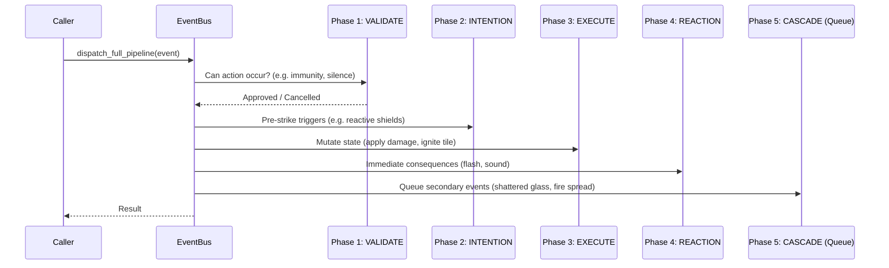

# Chapter 2: Architectural Patterns for Interconnected Systems

> *"The fatal flaw of classic object-oriented inheritance in game development is assuming entities have fixed, essential natures rather than dynamic, transient capabilities."*

---

## 2.1 The Failure of Classical Inheritance

Consider a traditional object-oriented hierarchy for an RPG:

```
GameObject
 ├── Item
 │    ├── Weapon
 │    └── Potion
 └── Actor
      ├── Player
      └── Monster
```

Now introduce emergent gameplay requirements:
1. A **Potion of Lamp Oil** can be quaffed (like an Item), thrown as a projectile (like a Weapon), splashed on the floor to form a flammable surface (like Terrain), or frozen into a solid block (like an Obstacle).
2. A **Monster** who is polymorphed into a wooden chest can be picked up, put into an inventory, opened, or chopped down for firewood.
3. An **Iron Sword** wielded in an electrical storm acts as a lightning rod, transferring current through the wielder's arm into a water puddle.

In classical single or multiple inheritance, accommodating these combinations leads to the **Diamond Inheritance Problem**, massive God-classes with hundreds of dormant boolean flags (`is_flammable`, `is_throwable`, `is_equippable`, `is_liquid`), or fragile subclass explosions.

---

## 2.2 Entity-Component-System (ECS) Architecture

To allow arbitrary combinations of behaviors, we separate identity, data, and behavior:

```mermaid
graph TD
    subgraph Entity ID
        E1["Entity #42 (Potion of Oil)"]
    end

    subgraph Pure Data Components
        C1[Position: Vec2(4, 5)]
        C2[Physics: weight=0.5, fragile=True]
        C3[LiquidContainer: oil, vol=50]
        C4[Flammable: fuel=25]
    end

    subgraph Systems / Pipelines
        S1[MovementSystem]
        S2[CellularSystem]
        S3[AffordancePipeline]
    end

    E1 --> C1
    E1 --> C2
    E1 --> C3
    E1 --> C4

    C1 -.-> S1
    C2 & C3 -.-> S3
    C4 -.-> S2
```

* **Entity**: A lightweight integer identifier (e.g. `entity_id = 42`).
* **Component**: A pure data container with no game logic (`dataclass`).
* **System / Pipeline**: Stateless functions that query entities possessing specific sets of components and mutate simulation state.

### High-Performance Python Component Storage
In Python 3.12, component storage can be implemented cleanly with typed dictionaries:

```python
from dataclasses import dataclass
from typing import TypeVar, Type, Any

T = TypeVar("T")

class EntityManager:
    def __init__(self) -> None:
        self._next_id: int = 1
        self._components: dict[Type[Any], dict[int, Any]] = {}

    def add_component(self, entity_id: int, component: Any) -> None:
        comp_type = type(component)
        if comp_type not in self._components:
            self._components[comp_type] = {}
        self._components[comp_type][entity_id] = component

    def get_component(self, entity_id: int, comp_type: Type[T]) -> T | None:
        return self._components.get(comp_type, {}).get(entity_id)
```

---

## 2.3 The Phased Multi-Stage Event Pipeline

When multiple reactive systems interact, a single event (e.g., *Player strikes Barrel with Flaming Torch*) must trigger multiple evaluation phases without causing race conditions or infinite call loops.

We structure our interaction pipeline into **5 explicit phases**:



### 1. `Phase.VALIDATE`
Handlers determine whether the action is legally allowed to proceed. Any handler can cancel the event or alter its parameters (e.g. target is in a temporal stasis field, preventing damage).

### 2. `Phase.INTENTION`
The action is validated and about to occur. Handlers can prepare the world state or trigger defensive reactions (e.g. a magical mirror reflects a spell beam before it lands).

### 3. `Phase.EXECUTE`
The canonical mutation takes place: HP is deducted, fuel is consumed, coordinates are updated.

### 4. `Phase.REACTION`
Immediate synchronous feedback occurs: visual animations are flagged, acoustic noise is generated for AI listening systems.

### 5. `Phase.CASCADE`
Consequential events are enqueued into a FIFO buffer rather than executed recursively. The event bus then drains this queue sequentially, with each child event incrementing its `depth`.

---

## 2.4 Guarding Against Recursion Cascades

To prevent catastrophic infinite loops (such as two conductive entities endlessly shocking each other), every event records its cascade depth. If `depth > MAX_CASCADE_DEPTH`, the event is automatically aborted:

```python
def dispatch_phase(self, event: Event, phase: Phase) -> bool:
    if event.depth > self.max_cascade_depth:
        event.cancel(f"Max cascade depth ({self.max_cascade_depth}) exceeded")
        return False

    for handler in self._handlers[type(event)][phase]:
        if event.cancelled and phase != Phase.VALIDATE:
            break
        handler(event, phase)

    return not event.cancelled
```

---

## 2.5 Time Scheduling: Energy-Based Tick Queues

Traditional roguelikes must support actors with varying movement and action speeds (e.g., a hasty rogue moving twice per round, or a heavy golem moving once every two rounds).

Rather than dividing turns into coarse rounds, we utilize an **Energy / Tick Accumulator Queue** using a priority min-heap:

$$\text{Next Ready Tick} = \text{Current Tick} + \left\lfloor \frac{\text{Standard Energy Cost} \times 1000}{\text{Actor Speed}} \right\rfloor$$

```python
import heapq
from dataclasses import dataclass, field

STANDARD_ENERGY_COST = 1000

@dataclass(order=True)
class ScheduledActor:
    ready_tick: int
    actor_id: int = field(compare=False)
    speed: int = field(default=1000, compare=False)

class EnergyScheduler:
    def __init__(self) -> None:
        self.current_tick: int = 0
        self._heap: list[ScheduledActor] = []

    def next_actor(self) -> int | None:
        if not self._heap:
            return None
        actor = heapq.heappop(self._heap)
        self.current_tick = actor.ready_tick
        return actor.actor_id

    def complete_turn(self, actor: ScheduledActor, cost_mult: float = 1.0) -> None:
        cost = int(STANDARD_ENERGY_COST * cost_mult)
        delay = max(1, (cost * 1000) // actor.speed)
        actor.ready_tick = self.current_tick + delay
        heapq.heappush(self._heap, actor)
```

With our foundational architecture established, we can now construct the reactive spatial world in Part II.
