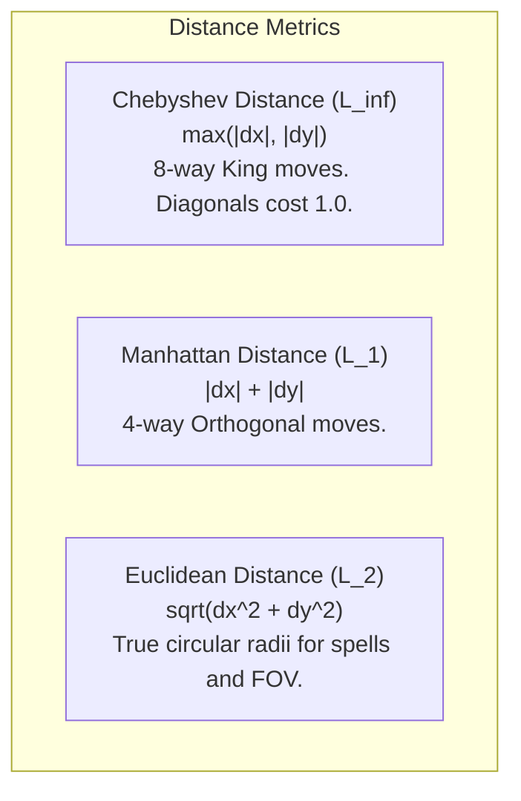

# Chapter 3: Spatial Models, Layered Topologies & Vision

> *"Space in a roguelike is not merely a geometric coordinate system; it is a dense medium through which physical forces, sensory information, and chemical reactions propagate."*

---

## 3.1 Discrete Distance Metrics and Tactical Topology

Traditional roguelikes exist on discrete grids. The choice of distance metric fundamentally dictates tactical combat and geometry:



### The Metric Mismatch Problem
In Chebyshev distance (standard 8-way movement), diagonals cost the same movement time as cardinal steps. As a result, a "circle" of radius $R$ is geometrically an axis-aligned square:

$$\text{Area}_{\text{Chebyshev}}(R) = (2R + 1)^2$$

If spell blast radii are calculated using Chebyshev distance, fireballs become expanding squares. If calculated using Euclidean distance, circular spells on a Chebyshev movement grid introduce tactical corner-cutting opportunities.

Our reference engine uses **Chebyshev distance** for actor movement adjacency and **Euclidean distance** for sensory perception and explosive blast radii to ensure natural circular decay.

---

## 3.2 The Layered Grid Architecture

In a rich systemic simulation, a single $(x, y)$ coordinate can simultaneously contain:
1. **Terrain**: A stone floor (`TileType.FLOOR`)
2. **Surface / Fluid**: A 2-inch pool of lamp oil (`FluidType.OIL, volume=40`)
3. **Atmosphere / Gas**: A dense bank of toxic smoke (`GasType.SMOKE, density=65`)
4. **Items**: A pile of wooden arrows and a gold ring
5. **Actor**: A goblin scout standing in the oil

```mermaid
graph TD
    subgraph Coordinate Tile at (x, y)
        ActorLayer[Actor Layer: Goblin Scout #104]
        ItemLayer["Item Layer: [Arrows #201, Ring #202]"]
        GasLayer["Gas Layer: Toxic Smoke (density=65)"]
        FluidLayer["Fluid Layer: Lamp Oil (volume=40)"]
        TerrainLayer[Terrain Layer: Stone Floor]
    end

    ActorLayer --> ItemLayer
    ItemLayer --> GasLayer
    GasLayer --> FluidLayer
    FluidLayer --> TerrainLayer
```

Stashing these directly in an unstructured array leads to overwriting bugs (e.g. dropping a potion deletes the floor tile). 

We encapsulate each coordinate as a discrete `CellState`:

```python
@dataclass(slots=True)
class CellState:
    tile: TileType = TileType.FLOOR
    fluid_type: FluidType = FluidType.NONE
    fluid_volume: int = 0
    gas_type: GasType = GasType.NONE
    gas_density: int = 0
    temperature: int = 20
    fire_intensity: int = 0
    fire_fuel: int = 0
    items: list[int] = field(default_factory=list)
    actor: int | None = None

    @property
    def blocks_vision(self) -> bool:
        if self.tile in (TileType.WALL, TileType.DOOR_CLOSED):
            return True
        # Dense smoke or opaque gas obscures vision
        return self.gas_type == GasType.SMOKE and self.gas_density > 60
```

---

## 3.3 Symmetric Shadowcasting

Field of View (FOV) determines what the player and autonomous agents can see.

### The Asymmetry Bug in Naive Raycasting
Naive line-of-sight (casting Bresenham rays to every perimeter tile) creates jagged artifacts and severe **asymmetry**: a monster standing behind a corner pillar can see the player, but the player cannot see the monster.

### The Shadowcasting Principle
**Symmetric Shadowcasting** operates by dividing the 2D grid around an observer into 8 octants. Within each octant, the algorithm sweeps outward row by row from slope $-1.0$ to $1.0$, projecting shadows when encountering opaque obstacles.

```
       \  Octant 1  /
        \          /
 Octant \   Row 3  / Octant
   7     \  Row 2 /     0
          \ Row 1/
           \ @  /
```

When a transparent tile is adjacent to an opaque tile in the same row, the algorithm calculates the exact angular slope boundary and recursively splits the view frustum into narrower sub-cones:

$$\text{Slope}_{\text{start}} = \frac{\text{col} - 0.5}{\text{row} + 0.5}, \quad \text{Slope}_{\text{end}} = \frac{\text{col} - 0.5}{\text{row} - 0.5}$$

```python
def _scan_octant(
    octant: int, origin: Vec2, radius: int, row: int,
    start_slope: float, end_slope: float,
    is_blocking: Callable[[Vec2], bool], visible: set[Vec2]
) -> None:
    if start_slope >= end_slope or row > radius:
        return

    first_col = int(math.floor(row * start_slope + 0.5))
    last_col = int(math.ceil(row * end_slope - 0.5))
    prev_blocked = False

    for col in range(first_col, last_col + 1):
        dx, dy = transform_octant(row, col, octant)
        pos = Vec2(origin.x + dx, origin.y + dy)

        if origin.euclidean_dist(pos) <= radius:
            visible.add(pos)

        blocked = is_blocking(pos)
        if prev_blocked:
            if not blocked:
                prev_blocked = False
                start_slope = (col - 0.5) / (row + 0.5)
        else:
            if blocked:
                prev_blocked = True
                new_end = (col - 0.5) / (row - 0.5)
                _scan_octant(octant, origin, radius, row + 1, start_slope, new_end, is_blocking, visible)

    if not prev_blocked:
        _scan_octant(octant, origin, radius, row + 1, start_slope, end_slope, is_blocking, visible)
```

This guarantees **mathematical symmetry**: $\text{Visible}(A, B) \iff \text{Visible}(B, A)$.

---

## 3.4 Multi-Sensory Propagation

Vision is only one perceptual channel. In systemic roguelikes, perception extends to:
1. **Infravision / Thermal Emission**: Hot entities (burning torches, fire elementals, lava) emit thermal signatures that bypass smoke banks.
2. **Tremorsense**: Heavy moving entities transmit vibrations through contiguous stone floor tiles.
3. **Acoustic Wavefronts**: Combat actions and explosions produce sound events that travel along open corridors, fading with distance and wall penetration.

With our spatial and sensory layers established, Chapter 4 examines the physical and cellular mechanics that animate this world.
