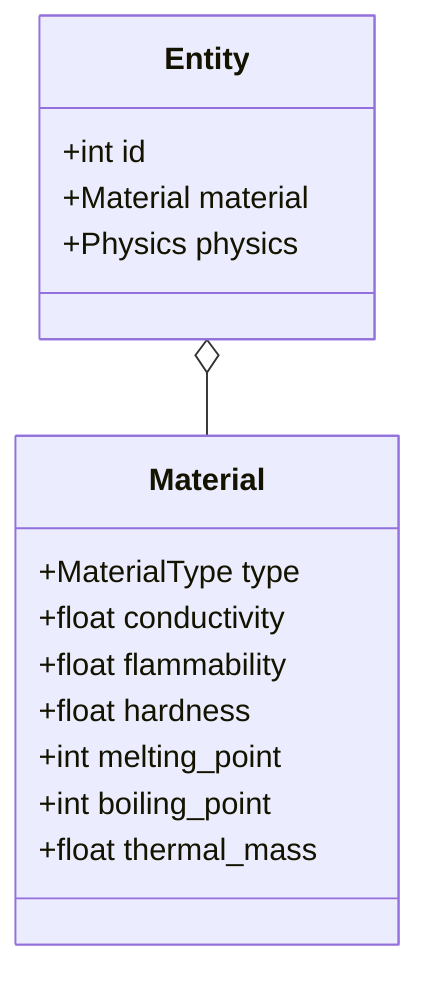
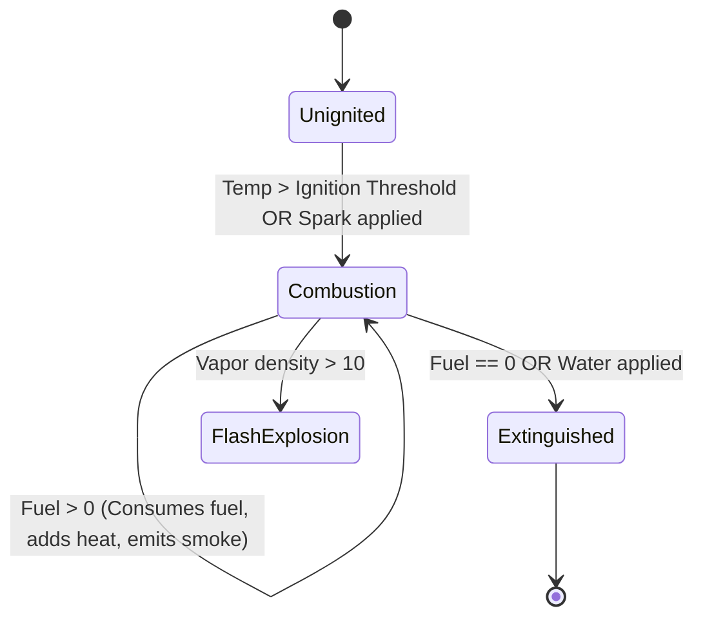
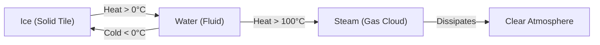

# Chapter 4: Material Systems & Cellular Automata

> *"Do not code a fire spell that hurts trolls. Code a fire system that releases thermal energy into matter, and make trolls out of flammable wood."*

---

## 4.1 Materials as First-Class Citizens

In many traditional games, an object's behavior is dictated by its high-level type (`Weapon`, `Consumable`, `Door`). In a systemic roguelike, an object's behavior is derived from its **constituent material properties**:



| Material | Conductivity ($0.0-1.0$) | Flammability ($0.0-1.0$) | Hardness | Melting Pt ($^\circ\text{C}$) |
| :--- | :---: | :---: | :---: | :---: |
| **Wood** | $0.05$ | $0.80$ | $2.0$ | Combusts @ $250^\circ\text{C}$ |
| **Iron** | $0.95$ | $0.00$ | $8.0$ | $1538^\circ\text{C}$ |
| **Flesh** | $0.40$ | $0.20$ | $1.0$ | Cooks @ $70^\circ\text{C}$ |
| **Glass** | $0.00$ | $0.00$ | $0.5$ (Fragile) | $1400^\circ\text{C}$ |
| **Water** | $0.85$ (Fluid) | $0.00$ | $0.0$ | Boils @ $100^\circ\text{C}$ |
| **Oil** | $0.10$ (Fluid) | $0.95$ | $0.0$ | Flashpoint @ $120^\circ\text{C}$ |

When an entity is struck by a fire spell, electric shock, or blunt force, the interaction resolver queries its `Material` component. A wooden door burns, an iron shield conducts electricity, and a glass potion shatters.

---

## 4.2 Cellular Automata for Environmental Simulation

Cellular Automata (CA) allow complex spatial simulations—such as fire spread, fluid pooling, and gas diffusion—to emerge from simple, localized neighborhood transition rules.

### The Double-Buffering Invariant
A critical error in naive CA implementation is modifying the grid in place during iteration:

```python
# Anti-pattern: In-place mutation causes directional skew
for y in range(height):
    for x in range(width):
        if grid[y][x].is_burning:
            grid[y+1][x].is_burning = True  # Burns instantly downward in 1 frame!
```

To maintain physical consistency, all updates must read from the **Current Buffer** ($T$) and write exclusively into the **Next Buffer** ($T + 1$), committing the new state in a single atomic step:

```python
def step(self) -> list[str]:
    # Read from self.grid, write into next_cells
    next_cells = [copy.deepcopy(cell) for cell in self.grid._cells]
    
    # 1. Evaluate Fire, Thermodynamics, and Phase Changes
    # 2. Evaluate Gas Diffusion
    # 3. Evaluate Fluid Leveling
    
    # Commit next_cells back to grid in-place
```

---

## 4.3 Fire, Combustion, and Thermodynamics

Fire is modeled as an active combustion state with temperature, fuel, and smoke output:



### Transition Equations
For any cell $(x, y)$ in state $T$:
1. **Heat Production**:
   $$T_{\text{next}} = T_{\text{curr}} + I_{\text{fire}} \times 5$$
2. **Fuel Consumption**:
   $$\text{Fuel}_{\text{next}} = \max(0, \text{Fuel}_{\text{curr}} - 1)$$
3. **Neighbor Ignition**:
   $$\forall n \in \text{Neighbors}_8(x, y): \text{If } \text{Flammable}(n) \land I_{\text{fire}}(x,y) > 0 \implies I_{\text{fire}}(n) \leftarrow \text{Ignite}$$

```python
if curr.fire_intensity > 0:
    nxt.temperature = min(1000, curr.temperature + curr.fire_intensity * 5)
    nxt.fire_fuel = max(0, curr.fire_fuel - 1)

    # Emit smoke into the atmosphere
    if nxt.gas_type in (GasType.NONE, GasType.SMOKE):
        nxt.gas_type = GasType.SMOKE
        nxt.gas_density = min(100, nxt.gas_density + 15)

    # Spread to adjacent flammable fluids (oil, alcohol)
    for neighbor in pos.neighbors_8():
        n_curr = self.grid.get_cell(neighbor)
        n_next = get_next(neighbor)
        if n_curr.fluid_type in (FluidType.OIL, FluidType.ALCOHOL) and n_next.fire_intensity == 0:
            n_next.fire_intensity = 80
            n_next.fire_fuel = n_curr.fluid_volume // 2 + 5
            n_next.temperature = max(n_next.temperature, 250)
```

---

## 4.4 Gas Diffusion and Pressure Equalization

Gases (smoke, poison gas, steam) expand outward to occupy open adjacent space while dissipating over time:

$$\text{Diffusion Amount} = \left\lfloor \frac{\text{Density}(x, y)}{|\text{Open Neighbors}| + 2} \right\rfloor$$

```python
for pos in self.grid.iter_positions():
    curr = self.grid.get_cell(pos)
    if curr.gas_density <= 0 or curr.gas_type == GasType.NONE:
        continue

    nxt = get_next(pos)
    nxt.gas_density = max(0, nxt.gas_density - 2) # Ambient dissipation

    open_neighbors = [n for n in pos.neighbors_4() if self.grid.get_cell(n).tile != TileType.WALL]
    if open_neighbors and curr.gas_density > 10:
        flow = curr.gas_density // (len(open_neighbors) + 2)
        for n_pos in open_neighbors:
            n_next = get_next(n_pos)
            if n_next.gas_type == GasType.NONE:
                n_next.gas_type = curr.gas_type
                n_next.gas_density = min(100, n_next.gas_density + flow)
```

---

## 4.5 Thermodynamic Phase Transitions

A hallmark of deep emergent simulation is matter changing physical states based on local temperature:



```python
# Water boils to Steam
if curr.fluid_type == FluidType.WATER and curr.temperature > 100:
    nxt.fluid_volume = max(0, curr.fluid_volume - 20)
    if nxt.fluid_volume == 0:
        nxt.fluid_type = FluidType.NONE
    nxt.gas_type = GasType.STEAM
    nxt.gas_density = min(100, nxt.gas_density + 30)

# Water freezes to Solid Ice
if curr.fluid_type == FluidType.WATER and curr.temperature < 0:
    nxt.tile = TileType.ICE
    nxt.fluid_type = FluidType.NONE
    nxt.fluid_volume = 0
```

By decoupling these physical equations into self-contained cellular rules, the world behaves like an interactive ecosystem where fire, smoke, water, and ice respond dynamically to player tactics.
