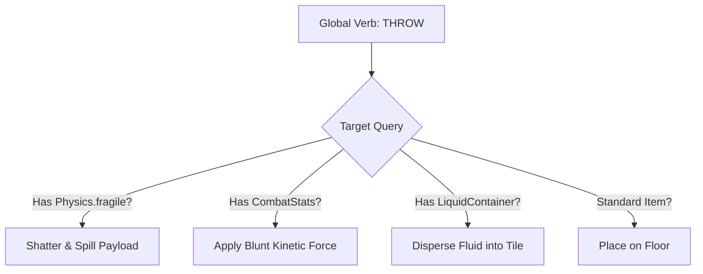

# Chapter 5: Verbs, Affordances & The Interaction Matrix

> *"An affordance is not a property of an object alone, nor is it a property of an actor alone. It is a relationship of possibility between them."*  
> — Adapted from James J. Gibson, *The Ecological Approach to Visual Perception*

---

## 5.1 Affordance Theory in Game Design

In traditional game engines, an action is often tightly bound to a specific actor-target pair:

```python
# The brittle approach: Nouns dictate verbs
class Player:
    def drink_potion(self, potion: HealingPotion): ...
    def unlock_door(self, door: WoodenDoor, key: BrassKey): ...
    def strike_goblin(self, goblin: Goblin, sword: IronSword): ...
```

This design fails the moment a player attempts to:
* Throw a healing potion at an undead skeleton to harm it with positive energy;
* Dip an arrow into a potion of poison;
* Kick a locked door to shatter its brittle hinges;
* Quaff lamp oil when covered in acid to coat their stomach lining.

Under **Affordance-Driven Architecture**, verbs query **component affordances** rather than concrete classes:



---

## 5.2 The Universal Verb Matrix

Our reference engine defines an extensible suite of foundational verbs:

| Verb | Required Component / Affordance | Systemic Outcome |
| :--- | :--- | :--- |
| **`Ignite`** | `Flammable` OR `Fluid(OIL/ALCOHOL)` | Raises local temp, initiates combustion, ignites adjacent vapors. |
| **`Electrify`** | `Conductive` OR `Fluid(WATER/ACID)` | Flood-fills contiguous conductive cells, shocks all occupants. |
| **`Freeze`** | `Fluid(WATER)` OR `Status(WET)` | Solidifies water into ice tiles; immobilizes and brittles actors. |
| **`Throw`** | `Physics` | Traces Bresenham trajectory; delivers kinetic impact & shatters fragile items. |
| **`Shatter`** | `Physics(fragile=True)` | Destroys container, spills contained fluids/gases onto landing tile. |
| **`Dip`** | `LiquidContainer` + Any Item | Coats item in target fluid (e.g. arrow dipped in oil or poison). |

---

## 5.3 Case Study: A 5-Link Emergent Cascade

Let us trace what happens under the hood when a player performs the following sequence:

1. **Player dips an wooden arrow into a vial of oil.**
   * `DipAction` attaches an `Oiled` status modifier to the arrow entity.
2. **Player touches the oiled arrow to a wall torch.**
   * `IgniteAction` sets `Flammable.is_burning = True` on the arrow.
3. **Player shoots the flaming arrow through a corridor filled with Flammable Vapor.**
   * As the projectile passes through each tile, the `CombustionSystem` detects `GasType.FLAMMABLE_VAPOR`.
   * The gas flashes into a raging fireball, creating a pressure wave that blows open a closed wooden door.
4. **The flaming arrow strikes an Explosive Red Barrel standing in a shallow puddle of water.**
   * `ThrowAction` deals kinetic damage, shattering the barrel.
   * `AffordanceSystem` triggers `Physics.explosive`, dealing 40 radial damage.
5. **The thermal wave superheats the water puddle.**
   * The water instantly vaporizes into a dense cloud of blinding `Steam`.
   * Two goblin archers on the other side of the room lose line of sight due to the steam cloud and fire randomly into the smoke.

```mermaid
sequenceDiagram
    participant Player
    participant Arrow as Arrow Entity
    participant Vapor as Flammable Vapor Tile
    participant Barrel as Explosive Barrel
    participant Water as Water Puddle
    participant Goblin as Goblin Archer

    Player->>Arrow: Dip in Oil & Ignite
    Arrow->>Vapor: Projectile passes through tile
    Note over Vapor: Vapor ignites into Fireball!
    Arrow->>Barrel: Kinetic Impact
    Note over Barrel: Barrel explodes (40 Radial Damage)!
    Barrel->>Water: 400°C Heat Wave
    Note over Water: Water boils into dense Steam cloud!
    Water->>Goblin: Steam blocks Line-of-Sight
    Note over Goblin: Goblin blinded; loses target lock!
```

Because every link in this chain was evaluated through decoupled event dispatches and cellular properties, no developer ever wrote a function named `shoot_flaming_arrow_through_gas_to_blow_up_barrel_and_steam_blind_goblins()`.

The behavior **emerged** entirely from orthogonal rules.
