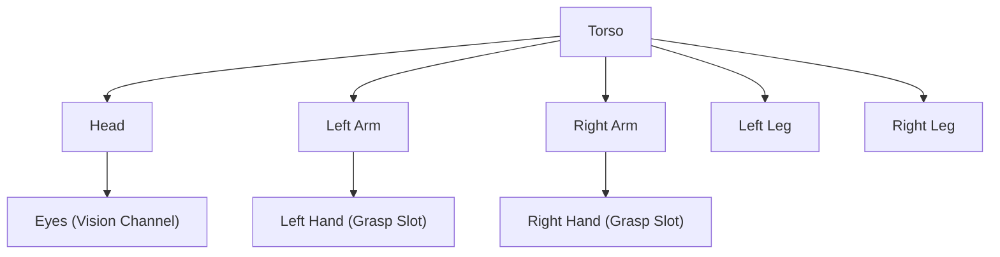
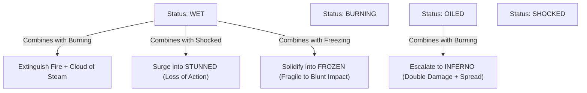

# Chapter 6: Dynamic Entity Composition & Reactive Status Effects

> *"A creature is not a static monolith of statistics; it is a modular biological system capable of mutation, dismemberment, and compounding chemical states."*

---

## 6.1 Modular Body Topologies

In conventional RPGs, equipment slots are hardcoded into an interface: `Head`, `Torso`, `MainHand`, `OffHand`, `Boots`.

In an emergent roguelike (in the lineage of *Caves of Qud* and *Dwarf Fortress*), bodies are dynamic graphs of **limbs and organs**:



When an actor undergoes dynamic mutations or injuries:
* **Severing an Arm**: Drops the arm as a physical meat item on the floor, destroys the attached hand equipment slot, and drops whatever weapon was wielded.
* **Growing Extra Limbs**: A chimera mutation adds two additional `Arm` nodes, instantly expanding the actor's grasp slots and allowing quadruple-wielding.

---

## 6.2 Status Effects as Reactive Modifier Stacks

A status effect is not merely a timer that inflicts damage; it is a **reactive state modifier** that alters how the entity interacts with all future events.

### Stacking and Modifier Pipelines
When an entity's attribute (e.g. movement speed, defense, thermal conductivity) is queried, it passes through the active modifier stack:

$$\text{Effective Speed} = (\text{Base Speed} + \sum \text{Flat Modifiers}) \times \prod \text{Multipliers}$$

```python
@dataclass
class ActiveStatus:
    status_type: StatusType
    duration: int
    intensity: int = 1

@dataclass
class StatusContainer:
    statuses: dict[StatusType, ActiveStatus] = field(default_factory=dict)
```

---

## 6.3 Compounding Status Interactions

Emergent status design means statuses **react with each other** upon application, forming a chemical state transition graph:



### Implementing Compounding Rules in Python

```python
def apply_status(self, entity_id: int, status_type: StatusType, duration: int, intensity: int = 1) -> list[str]:
    container = self.ecs.get_component(entity_id, StatusContainer)
    existing = container.statuses

    # 1. Wet + Burning -> Extinguish and emit Steam
    if status_type == StatusType.WET and StatusType.BURNING in existing:
        del existing[StatusType.BURNING]
        self._emit_steam_at(entity_id)
        return [f"Entity {entity_id}'s flames were extinguished in a cloud of steam!"]

    # 2. Oiled + Burning -> Inferno
    if status_type == StatusType.BURNING and StatusType.OILED in existing:
        del existing[StatusType.OILED]
        intensity *= 2
        duration += 3
        existing[StatusType.BURNING] = ActiveStatus(StatusType.BURNING, duration, intensity)
        return [f"The oil on Entity {entity_id} ignited into an inferno!"]

    # 3. Wet + Shocked -> Stunned
    if status_type == StatusType.SHOCKED and StatusType.WET in existing:
        existing[StatusType.STUNNED] = ActiveStatus(StatusType.STUNNED, duration=2, intensity=1)
        return [f"Electric current surged through the water on Entity {entity_id}, stunning them!"]

    existing[status_type] = ActiveStatus(status_type, duration, intensity)
    return [f"Entity {entity_id} is now {status_type.name.lower()}."]
```

---

## 6.4 Guarding Against Status Infinite Recursion

Consider a circular status trap:
* Status A applies Status B.
* Status B applies Status A.

Without defensive architecture, this triggers an immediate `RecursionError`. We protect the simulation through two invariants:
1. **Atomic Application**: A status application cannot trigger synchronous event re-entry on the same entity during the same call stack frame.
2. **Decoupled Tick Resolution**: Ongoing periodic damage (e.g. poison ticks, burning ticks) is evaluated strictly during the entity's scheduled turn in the `EnergyScheduler`, preventing cascading tick storms within a single time slice.
