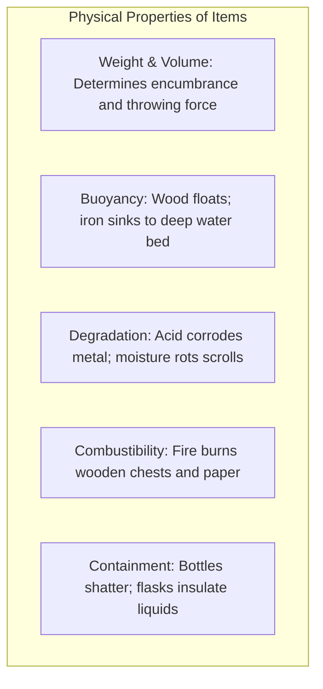

# Chapter 7: Emergent Item Systems, Alchemy & Deduction

> *"An unidentified potion is not merely a randomized loot drop; it is a chemical reagent and an information puzzle waiting to be solved."*

---

## 7.1 Items as First-Class Physical Actors

In traditional roguelikes, items are not inert inventory strings. They possess physical properties that participate in the world simulation even when lying on the ground or stored inside containers:



### The Container Cascade
When an iron chest containing three spell scrolls and a potion of water is exposed to dragon fire:
1. The chest's iron material resists combustion (`flammability = 0.0`).
2. However, heat conducts through the iron (`conductivity = 0.95`), raising the chest's internal cavity temperature to $350^\circ\text{C}$.
3. The glass potion bottle reaches its boiling point, violently bursting from thermal steam pressure.
4. The released water evaporates into steam, soaking and extinguishing the burning scrolls inside before they turn to ash.

---

## 7.2 Chemical Alchemy and Fluid Mixing

Rather than hardcoding static crafting recipes (`Item A + Item B = Item C`), an emergent alchemy system models **thermodynamic fluid reactions**:

```mermaid
graph LR
    Acid["Acid Pool"] + Water["Water Pool"] --> Dilute["Exothermic Dilution<br/>(Produces Acrid Steam + Heat)"]
    Alcohol["Alcohol Flask"] + Acid["Acid Pool"] --> Toxic["Chemical Synthesis<br/>(Billowing Poison Gas Cloud)"]
    Oil["Oil Slick"] + Water["Water Pool"] --> Layer["Immiscible Multi-Layer Pool"]
```

```python
@dataclass(frozen=True)
class ReactionResult:
    resulting_fluid: FluidType
    resulting_volume: int
    resulting_gas: GasType = GasType.NONE
    gas_amount: int = 0
    temperature_delta: int = 0
    message: str = ""

class AlchemySystem:
    @staticmethod
    def mix_fluids(fluid_a: FluidType, vol_a: int, fluid_b: FluidType, vol_b: int) -> ReactionResult:
        pair = {fluid_a, fluid_b}

        # Acid + Water: Exothermic dilution
        if pair == {FluidType.ACID, FluidType.WATER}:
            return ReactionResult(
                resulting_fluid=FluidType.WATER,
                resulting_volume=vol_a + vol_b,
                resulting_gas=GasType.STEAM,
                gas_amount=20,
                temperature_delta=40,
                message="Acid violently hissed as it was diluted by water, sending up acrid steam!"
            )

        # Alcohol + Acid: Volatile toxic gas synthesis
        if pair == {FluidType.ALCOHOL, FluidType.ACID}:
            return ReactionResult(
                resulting_fluid=FluidType.NONE,
                resulting_volume=0,
                resulting_gas=GasType.POISON_GAS,
                gas_amount=60,
                temperature_delta=60,
                message="Alcohol and acid synthesized violently into a billowing toxic vapor cloud!"
            )

        # Oil + Water: Immiscible
        if pair == {FluidType.OIL, FluidType.WATER}:
            dominant = FluidType.OIL if vol_a >= vol_b else FluidType.WATER
            return ReactionResult(dominant, vol_a + vol_b, message="Oil floats atop the water.")

        return ReactionResult(fluid_a, vol_a + vol_b)
```

---

## 7.3 Identification as Deductive Reasoning

A core pleasure of traditional roguelikes (*NetHack*, *Brogue*, *Caves of Qud*) is **deductive identification under incomplete information**.

### The Three Tiers of Information
```
[Unidentified]  --> "A smoky magenta potion"
[Partially Known] --> "This potion is flammable and tastes like petroleum"
[Fully Identified] --> "Potion of Lamp Oil"
```

### Contextual Identification Affordances
Instead of forcing players to hoard expensive "Scrolls of Identify", systemic design invites players to test items through environmental interaction:
* **The Fire Test**: Throwing an unidentified potion into a burning campfire. If it extinguishes the flame, it is *Water*; if it explodes into a blaze, it is *Oil* or *Alcohol*; if it turns the flame green, it is *Acid*.
* **The Price ID Puzzle**: Merchants buy items based on true value. A player observing a shopkeeper offering 150 gold for a ruby ring can deduce it is a *Ring of Teleportation Control* rather than a *Ring of Warning*.
* **The Monster Test**: Throwing an unidentified wand at a monster. If the monster turns invisible, it is a *Wand of Invisibility*; if the monster bounces backward, it is a *Wand of Force*.

This transforms inventory management from a bookkeeping chore into an active scientific experiment.
