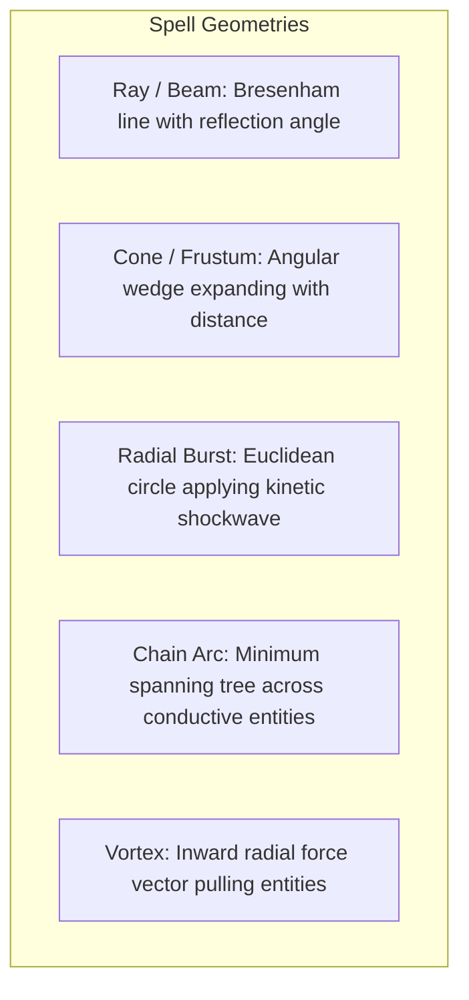
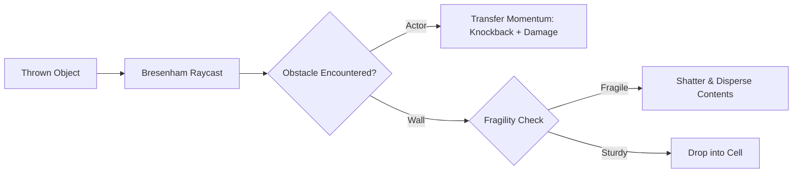

# Chapter 8: Magic, Projectiles & Spatial Mechanics

> *"A spell should not merely apply damage in a radius; it should displace mass, reflect off reflective surfaces, and fundamentally alter the local topology."*

---

## 8.1 Spatial Spell Geometries

Spells in an emergent roguelike are spatial mathematical functions mapped across discrete coordinates:



### Specular Beam Reflection
When a magical ray (such as a *Lightning Bolt* or *Laser Beam*) strikes a solid wall, instead of terminating, it can reflect specularly across the normal vector:

```python
def reflect_vector(direction: Vec2, wall_normal: Vec2) -> Vec2:
    # On discrete square grids, hitting a vertical wall inverts dx; horizontal inverts dy
    return Vec2(
        -direction.x if wall_normal.x != 0 else direction.x,
        -direction.y if wall_normal.y != 0 else direction.y,
    )
```

In tight dungeon corridors, a single lightning bolt can ricochet three or four times, carving through an entire advancing goblin column before striking the caster who miscalculated the bounce angle (a quintessential *NetHack* tactical lesson).

---

## 8.2 Projectile Physics and Kinetic Transfer

When a physical item (an iron javelin, a boulder, or a potion flask) is launched, it carries **kinetic momentum**:

$$E_k = \frac{1}{2} m v^2$$



### Momentum-Driven Knockback
If kinetic energy exceeds the target actor's stability threshold:
1. The actor is shoved $K$ tiles backward along the impact vector.
2. If the actor collides with a solid wall during knockback, they suffer **blunt impact damage** proportional to remaining momentum.
3. If the actor is shoved into an open chasm, they fall, triggering vertical transition mechanics.

---

## 8.3 Blast Dynamics and Structural Destruction

Explosions are modeled as two coupled phenomena:
1. **Thermal Radiance**: Instantaneous spike in temperature ($+400^\circ\text{C}$), igniting flammable tiles and vaporizing standing fluids.
2. **Kinetic Shockwave**: Radial force expanding outward from the epicenter, destroying fragile structures:

```python
def apply_explosion(epicenter: Vec2, radius: int, peak_force: int, grid: LayeredGrid, ecs: EntityManager):
    for dy in range(-radius, radius + 1):
        for dx in range(-radius, radius + 1):
            target = Vec2(epicenter.x + dx, epicenter.y + dy)
            if not grid.in_bounds(target):
                continue
                
            dist = epicenter.euclidean_dist(target)
            if dist > radius:
                continue

            # Attenuation with distance
            force = int(peak_force * (1.0 - dist / (radius + 1)))
            cell = grid.get_cell(target)

            # Structural destruction
            if cell.tile == TileType.DOOR_CLOSED or cell.tile == TileType.DOOR_OPEN:
                cell.tile = TileType.FLOOR
                # Spawn wooden splinters item

            # Thermal flash
            cell.temperature += force * 10
            cell.fire_intensity = max(cell.fire_intensity, force)
```

---

## 8.4 Reality-Warping Mechanics

Systemic engines shine brightest when handling non-Euclidean magical phenomena:

### 1. Telefragging (Spatial Occlusion Resolution)
When an actor teleports onto a coordinate occupied by another actor:
* If both are solid, the teleported actor's mass shears through the occupying entity, causing catastrophic damage proportional to relative mass.
* If teleporting into solid stone, the actor is crushed or shifted to the nearest open topological manifold.

### 2. Polymorph Chains
Polymorphing an entity alters its `Material`, `Renderable`, and `CombatStats` while preserving its identity, tags, and inventory. Polymorphing an angry dragon into a mouse retains its inventory; polymorphing a water puddle into a gelatinous cube absorbs all items resting on the tile into the cube's gelatinous body.
