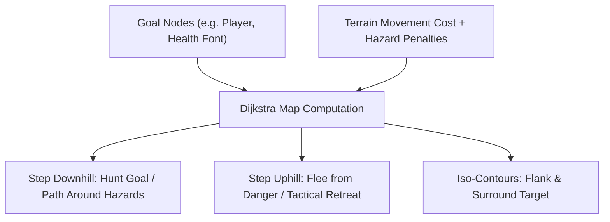
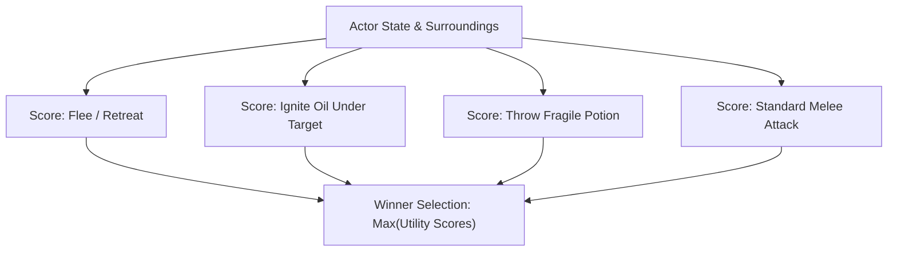
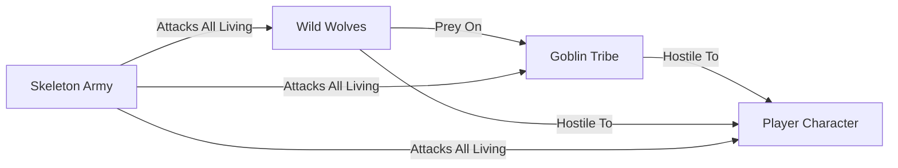

# Chapter 9: The Living Dungeon: AI & Ecosystems

> *"If monsters only exist to run directly at the player and deal damage, the dungeon is not an ecosystem; it is a queue of numbers waiting to be decremented."*

---

## 9.1 The Failure of Simple Aggro

In naive roguelikes, enemy AI consists of a single loop:
$$\text{If player visible } \implies \text{Step towards player } \implies \text{Attack}$$

This produces flat, repetitive gameplay where monsters blindly march through blazing fire, step into pools of bubbling acid, and ignore weapons lying on the ground.

In an emergent roguelike, creatures:
1. **Perceive Hazards**: Value their own survival and avoid dangerous surfaces.
2. **Exploit the Environment**: Kick braziers, shatter oil potions under the player, and seek chokepoints.
3. **Participate in Ecology**: Hunt prey, scavenge corpses, fight rival factions, and flee when wounded.

---

## 9.2 Tactical Dijkstra Maps

While $A^*$ is excellent for single-source to single-destination pathfinding, it is computationally expensive to run independently for dozens of monsters every turn.

**Dijkstra Maps** (popularized by Brian Walker in *Brogue*) solve multi-agent navigation, hazard avoidance, and tactical retreats simultaneously using a single distance field computation.



### Hazard Cost Weighting
To teach monsters to respect environmental hazards, we inject dynamic cost penalties into the Dijkstra calculation:

$$\text{Step Cost}(n) = \text{Base Cost}(n) + \text{Hazard Penalty}(n)$$

```python
class DijkstraMap:
    def compute(self, goals: Iterable[Vec2], hazard_cost_fn: Callable[[Vec2], int] | None = None) -> None:
        self._values = [self.INFINITY] * (self.width * self.height)
        heap: list[tuple[int, int, int]] = []

        for goal in goals:
            if self.grid.in_bounds(goal):
                idx = self._index(goal)
                self._values[idx] = 0
                heapq.heappush(heap, (0, goal.x, goal.y))

        while heap:
            cost, x, y = heapq.heappop(heap)
            curr = Vec2(x, y)

            if cost > self._values[self._index(curr)]:
                continue

            for neighbor in curr.neighbors_8():
                if not self.grid.in_bounds(neighbor):
                    continue

                cell = self.grid.get_cell(neighbor)
                if cell.tile in (TileType.WALL, TileType.DOOR_CLOSED):
                    continue

                base_step = 14 if (neighbor.x != x and neighbor.y != y) else 10
                hazard_penalty = 0
                if hazard_cost_fn:
                    hazard_penalty = hazard_cost_fn(neighbor)
                else:
                    if cell.fire_intensity > 0:
                        hazard_penalty += 200  # High penalty for fire
                    if cell.fluid_type == FluidType.ACID:
                        hazard_penalty += 150  # High penalty for acid

                new_cost = cost + base_step + hazard_penalty
                n_idx = self._index(neighbor)

                if new_cost < self._values[n_idx]:
                    self._values[n_idx] = new_cost
                    heapq.heappush(heap, (new_cost, neighbor.x, neighbor.y))
```

* **Hunting**: Stepping **downhill** leads the monster directly to the player via the safest available path around fire and acid.
* **Fleeing**: Stepping **uphill** guides a wounded creature away from the player into uncharted rooms.

---

## 9.3 Utility AI for Environmental Exploitation

To enable creatures to make creative tactical choices, we implement a **Utility AI System**. Instead of rigid decision trees, every possible action receives a continuous utility score between $0.0$ and $10.0$:



```python
class UtilityAI:
    def evaluate_best_action(self, actor_id: int, enemy_id: int | None) -> UtilityAction:
        actor_pos = self.ecs.get_component(actor_id, Position)
        actor_stats = self.ecs.get_component(actor_id, CombatStats)
        best_action = UtilityAction("wait", utility_score=1.0)

        # 1. Self-preservation curve (Sigmoid / Inverse Ratio)
        hp_ratio = actor_stats.hp / max(1, actor_stats.max_hp)
        if hp_ratio < 0.25 and enemy_id:
            flee_score = (1.0 - hp_ratio) * 10.0
            if flee_score > best_action.utility_score:
                best_action = UtilityAction("flee", target_id=enemy_id, utility_score=flee_score)

        # 2. Environmental affordance: Ignite oil under enemy
        if enemy_id:
            enemy_pos = self.ecs.get_component(enemy_id, Position)
            if enemy_pos:
                enemy_cell = self.grid.get_cell(enemy_pos.pos)
                if enemy_cell.fluid_type == FluidType.OIL and enemy_cell.fire_intensity == 0:
                    # High utility to trigger oil explosion under the enemy!
                    oil_score = 8.5
                    if oil_score > best_action.utility_score:
                        best_action = UtilityAction("ignite_hazard", target_pos=enemy_pos.pos, utility_score=oil_score)

        # 3. Direct Melee Attack
        if enemy_id and actor_pos.pos.chebyshev_dist(enemy_pos.pos) == 1:
            melee_score = 6.0
            if melee_score > best_action.utility_score:
                best_action = UtilityAction("attack", target_id=enemy_id, utility_score=melee_score)

        return best_action
```

---

## 9.4 Ecological Faction Systems and Infighting

Dungeons feel alive when creatures have autonomous agendas beyond attacking the player:



```python
class FactionSystem:
    _DEFAULT_RELATIONS = {
        ("goblin", "player"): Disposition.HOSTILE,
        ("wolf", "player"): Disposition.HOSTILE,
        ("wolf", "goblin"): Disposition.PREY,      # Wolves hunt goblins
        ("goblin", "wolf"): Disposition.HOSTILE,    # Goblins fight off wolves
        ("undead", "player"): Disposition.HOSTILE,
        ("undead", "goblin"): Disposition.HOSTILE,  # Undead kill everything living
        ("undead", "wolf"): Disposition.HOSTILE,
    }
```

When a player lures a pack of wild wolves into a goblin barricade, the player can step back, watch the battle unfold, and finish off the wounded survivors.
