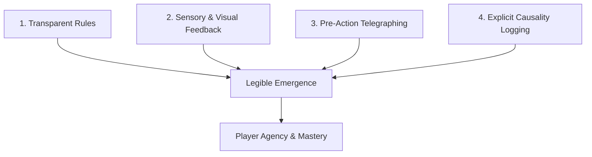
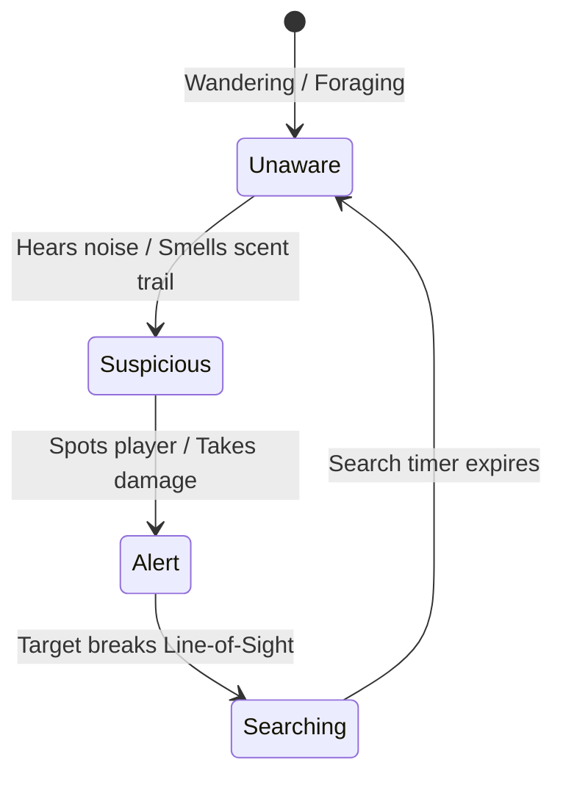

# Chapter 10: Information, Perception & Player Agency

> *"When a player dies from an emergent chain reaction they understood and anticipated, they laugh and restart. When they die from an invisible cascade they could not see, they uninstall."*

---

## 10.1 The Principle of Legible Complexity

Emergence is thrilling because of **unforeseen combinations of known rules**. However, if the player does not possess accurate information about the world state, emergence collapses into feeling like arbitrary cruelty.



To preserve player agency in complex systemic environments:
1. **Never hide physical laws**: If oil is flammable, all oil in the world must burn consistently.
2. **Telegraph large cascades**: High-impact explosions and environmental collapses should give the player at least 1 turn of warning (e.g. *"The ceiling groans under severe structural strain..."*).
3. **Log causality, not just damage**: Do not output `"You take 45 damage."` Output: `"The barrel exploded, detonating the oil slick, engulfing you in flames for 45 damage!"`

---

## 10.2 Asymmetric Perception and Monster Memory

Entities in the game world do not share a global omniscience map. Each autonomous agent possesses its own **Perceptual Profile** and **Spatial Memory**:



```python
@dataclass
class AgentMemory:
    last_known_target_pos: Vec2 | None = None
    turns_since_spotted: int = 0
    alert_state: str = "unaware"  # unaware, suspicious, alert, searching
    investigation_target: Vec2 | None = None
```

When a player breaks line-of-sight around a corner and steps into a side alcove:
1. The chasing goblin continues running toward `last_known_target_pos` (the corner tile).
2. Arriving at the corner, the goblin finds the player missing and transitions to `searching` mode, sweeping adjacent corridors.
3. This creates tactical affordances for **stealth, ambushes, and distraction** (such as throwing a rock down an opposite hallway to produce an acoustic alert).

---

## 10.3 Acoustic Wavefronts and Scent Trails

### Acoustic Propagation
Every significant action produces an acoustic wavefront with a volume rating (in decibels / radius):

```python
def emit_sound(origin: Vec2, volume: int, grid: LayeredGrid, ecs: EntityManager):
    # Propagate sound through open tiles with attenuation
    dmap = DijkstraMap(grid)
    dmap.compute([origin])
    
    for entity, (pos, sensory, memory) in ecs.query(Position, SensoryProfile, AgentMemory):
        dist = dmap.get(pos.pos)
        if dist <= volume and sensory.has_hearing:
            memory.alert_state = "suspicious"
            memory.investigation_target = origin
```

| Action | Acoustic Radius (Tiles) |
| :--- | :---: |
| **Creeping / Sneaking** | $1$ |
| **Standard Movement** | $3$ |
| **Melee Combat** | $6$ |
| **Shattering Potion Bottle** | $8$ |
| **Explosion / Structural Collapse** | $25$ (Full Level Alert) |

---

## 10.4 Causality Tracking in Post-Mortem Logs

When an event triggers cascades, tracking `parent_id` on every event allows reconstructing the exact causal graph of any death or victory:

```
[DEATH RECONSTRUCTION - TURN 412]
├─ Player threw Potion of Lamp Oil at (12, 8)
│  └─ Potion shattered on stone wall -> Spilled 50 units of Oil
├─ Goblin Shaman cast Spark at (12, 8)
│  └─ Spark ignited Oil -> Firestorm initiated
│     ├─ Firestorm superheated Water Puddle -> Produced 40 density Steam
│     └─ Firestorm detonated Explosive Barrel at (13, 8)
│        └─ Radial Explosion (40 Damage) -> Struck Player (HP: 28 -> -12) [FATAL]
```

This degree of causality logging transforms defeats into memorable, hilarious, and intellectually satisfying learning experiences.
