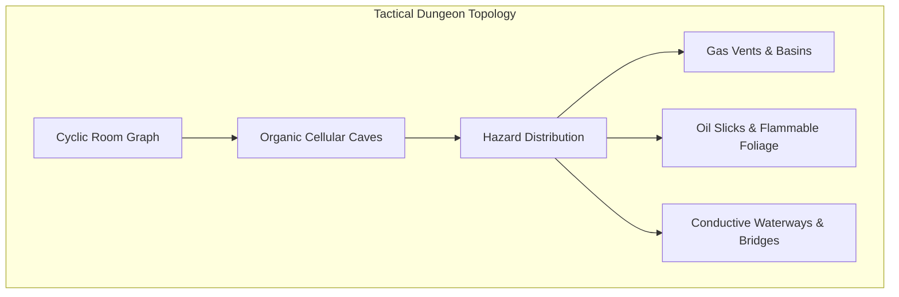
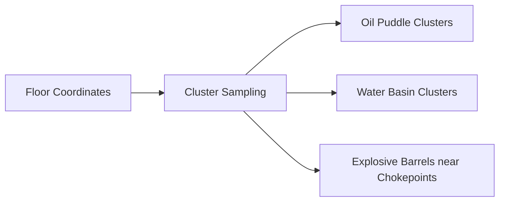

# Chapter 11: Level Generation with Tactical Affordances

> *"A procedural dungeon should not be a maze of empty rectangular rooms; it should be an obstacle course of tactical affordances and environmental pressure cookers."*

---

## 11.1 Designing Topologies for Emergence

Procedural generation (ProcGen) in traditional roguelikes is often taught as generating rooms and hallways via Binary Space Partitioning (BSP) or Random Walks. 

However, flat rectangular rooms connected by straight corridors produce monotonous combat: players back up into a 1-tile corridor, press the attack key repeatedly to funnel monsters, and repeat.

To foster emergent play, levels must feature **topological friction**:
* **Chokepoints & Flanking Loops**: Cyclic graphs that allow both player and AI to flank or retreat.
* **Elevation & Chasm Barriers**: Obstacles that can be bypassed using kinetic throwing, teleportation, or bridge construction.
* **Hazard Basins**: Low-lying depressions where heavy gases (poison, smoke) settle and liquids pool.



---

## 11.2 Cellular Automata Cave Generation (The 4-5 Rule)

For organic, natural subterranean caverns, the **4-5 Cellular Automata** algorithm produces winding caverns with natural alcoves and varying corridor widths:

```python
class CellularCaveGenerator:
    @staticmethod
    def generate(grid: LayeredGrid, fill_prob: float = 0.45, iterations: int = 4, rng: random.Random | None = None) -> None:
        rand = rng or random.Random()
        w, h = grid.width, grid.height

        # 1. Initialize with uniform random noise
        for y in range(h):
            for x in range(w):
                pos = Vec2(x, y)
                if x == 0 or x == w - 1 or y == 0 or y == h - 1:
                    grid.set_tile(pos, TileType.WALL)
                elif rand.random() < fill_prob:
                    grid.set_tile(pos, TileType.WALL)
                else:
                    grid.set_tile(pos, TileType.FLOOR)

        # 2. Smooth via 4-5 rule
        for _ in range(iterations):
            new_tiles: dict[Vec2, TileType] = {}
            for y in range(1, h - 1):
                for x in range(1, w - 1):
                    pos = Vec2(x, y)
                    wall_count = sum(1 for n in pos.neighbors_8() if grid.get_cell(n).tile == TileType.WALL)
                    new_tiles[pos] = TileType.WALL if wall_count >= 5 else TileType.FLOOR

            for p, tile in new_tiles.items():
                grid.set_tile(p, tile)
```

---

## 11.3 Procedural Placement of Tactical Features

Once the geometric foundation is carved, we populate the map with **tactical features**:



```python
class TacticalFeaturePlacer:
    @staticmethod
    def populate(grid: LayeredGrid, ecs: EntityManager, rng: random.Random | None = None) -> None:
        rand = rng or random.Random()
        floor_positions = [
            p for p in grid.iter_positions()
            if grid.get_cell(p).tile == TileType.FLOOR and grid.get_cell(p).actor is None
        ]
        rand.shuffle(floor_positions)

        # 1. Spawn Oil Pools
        for center in floor_positions[:3]:
            for n in [center] + center.neighbors_4():
                if grid.in_bounds(n) and grid.get_cell(n).tile == TileType.FLOOR:
                    cell = grid.get_cell(n)
                    cell.fluid_type = FluidType.OIL
                    cell.fluid_volume = 50

        # 2. Spawn Conductive Water Basins
        for center in floor_positions[3:6]:
            for n in [center] + center.neighbors_4():
                if grid.in_bounds(n) and grid.get_cell(n).tile == TileType.FLOOR:
                    cell = grid.get_cell(n)
                    cell.fluid_type = FluidType.WATER
                    cell.fluid_volume = 60

        # 3. Spawn Explosive Barrels near tactical bottlenecks
        for b_pos in floor_positions[6:10]:
            barrel = ecs.create_entity(name="Explosive Barrel", tags={"explosive", "container"})
            ecs.add_component(barrel.id, Position(b_pos))
            ecs.add_component(barrel.id, Renderable(glyph="O", color="red", name="Explosive Barrel", render_order=5))
            ecs.add_component(barrel.id, Physics(weight=25.0, fragile=True, explosive=True, explosion_radius=2, explosion_damage=40))
            ecs.add_component(barrel.id, Flammable(fuel=15, ignition_temp=120))
            grid.add_item(barrel.id, b_pos)
```

Placing these features creates dynamic battlegrounds where every room offers distinct tactical opportunities (e.g. electrocuting water puddles, igniting oil slicks, or luring enemies toward explosive barrels).
