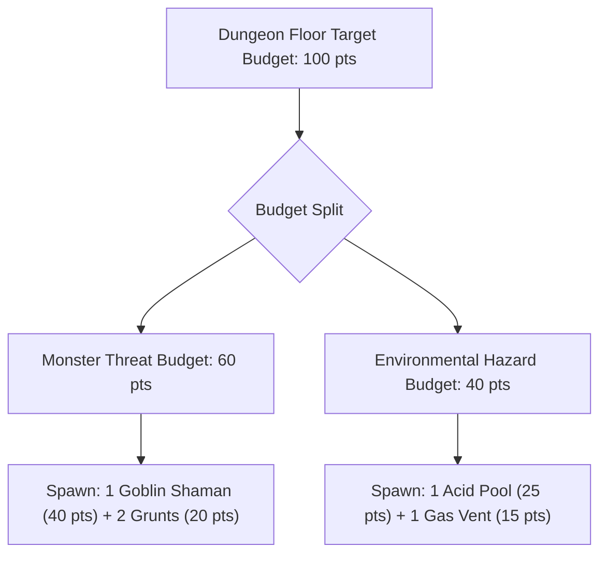
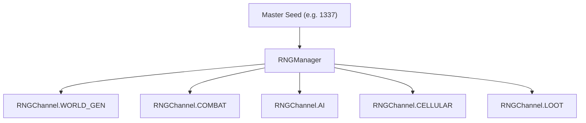

# Chapter 12: Procedural Encounters, Synergies & Bounded Chaos

> *"A procedural encounter should not simply be five goblins waiting in a room. It should be a dynamic scenario mid-motion—a predator stalking prey, or rival factions disputing territory over an environmental hazard."*

---

## 12.1 Threat Budgets & Hazard Budgets

In traditional RPG encounter design, a room's difficulty is calculated purely by summing monster Combat Ratings ($\sum \text{CR}$).

In a systemic roguelike, this formula is fatally flawed: a room containing two weak goblins is trivial on flat dry ground, but lethal if the floor is an electrified acid pool surrounded by poison vents.

We model encounter difficulty using a **Dual-Budget System**:

$$\text{Total Challenge} = w_m \cdot \text{Threat Budget} + w_h \cdot \text{Hazard Budget}$$



When the ProcGen algorithm allocates high environmental hazard density to a sector, it automatically dials back monster spawns, preventing unfair, unwinnable death traps.

---

## 12.2 Synergistic and Antagonistic Encounter Pairs

To spark emergent battles, the encounter generator intentionally spawns **synergistic pairs** and **antagonistic factions**:

### 1. Synergistic Encounter Pairs (High Threat)
* **Oil Slug + Fire Imp**: The oil slug coats the battlefield and player in flammable oil; the fire imp casts ignition sparks.
* **Frost Witch + Water Golem**: The water golem douses actors in water; the frost witch freezes the puddle, trapping the player in solid ice.

### 2. Antagonistic Encounters (Tactical Opportunities)
* **Wolf Pack + Goblin Guard**: Spawned adjacent to each other. When the player approaches, the two groups are already locked in combat, allowing the player to choose whether to intervene, sneak past, or exploit the distraction.

---

## 12.3 Deterministic Seeding and Isolated RNG Streams

A critical architectural pitfall in procedural games is relying on a single global pseudo-random number generator (such as Python's default `random`).

### The Butterfly Effect Bug
If a single monster takes an extra combat swing on Turn 3, it consumes an extra random number from the global stream. This alters the RNG state, causing Dungeon Floor 2 to generate with a completely different map layout!

### Channel-Partitioned RNG Architecture
To maintain strict determinism, we partition the random number generator into **isolated subsystem streams**:



```python
class RNGChannel(Enum):
    WORLD_GEN = auto()
    COMBAT = auto()
    AI = auto()
    CELLULAR = auto()
    LOOT = auto()

class RNGManager:
    def __init__(self, master_seed: int = 1337) -> None:
        self.reseed(master_seed)

    def reseed(self, master_seed: int) -> None:
        self.master_seed = master_seed
        master_rng = random.Random(master_seed)
        self._streams = {}
        for channel in RNGChannel:
            sub_seed = master_rng.randint(0, 2**31 - 1)
            self._streams[channel] = random.Random(sub_seed)

    def get(self, channel: RNGChannel) -> random.Random:
        return self._streams[channel]
```

With isolated streams:
* Player combat actions consume numbers exclusively from `RNGChannel.COMBAT`.
* Next-level floor generation reads exclusively from `RNGChannel.WORLD_GEN`, guaranteeing that identical world seeds generate identical dungeon layouts regardless of player combat turns.
