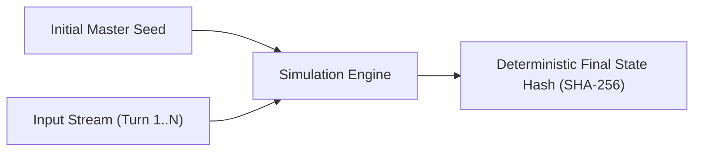
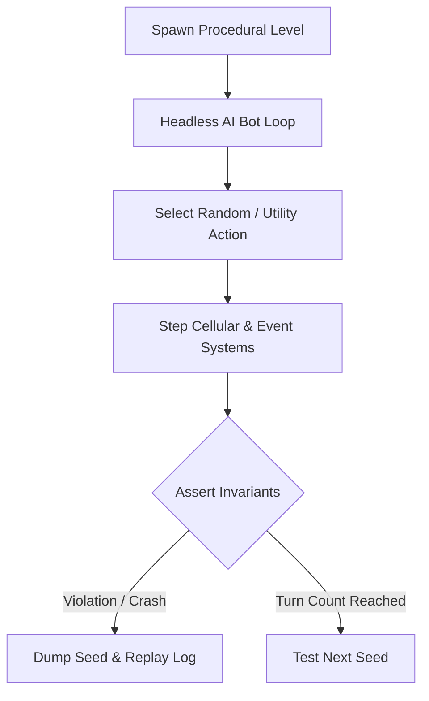

# Chapter 13: Determinism, State Serialization & Replays

> *"If a simulation cannot be serialized to disk and replayed deterministically from an input log, it cannot be debugged at scale."*

---

## 13.1 Pure State vs. Side Effects

In an emergent roguelike containing hundreds of simultaneous interactions, reproducing complex bugs requires **deterministic simulation**.

To achieve strict determinism:
1. **No External Clock Calls in Core Logic**: Never call `time.time()` or `datetime.now()` to compute cooldowns or decay. All time is measured in discrete **Simulation Ticks**.
2. **No Unseeded Random Calls**: Direct calls to `random.random()` or global system entropy are forbidden; all randomness flows through partitioned `RNGManager` channels.
3. **Deterministic Iteration Order**: Avoid iterating over native Python `set` or `dict` objects where hash seed randomization can alter execution order across process restarts. Order entities by monotonic integer `id`.



---

## 13.2 State Serialization and Save-Game Schema

Because components in our ECS are pure Python dataclasses, serializing the entire world state into JSON or binary formats is straightforward:

```python
import json
from typing import Any

def serialize_world(grid: LayeredGrid, ecs: EntityManager, scheduler: EnergyScheduler) -> str:
    state = {
        "version": 1,
        "scheduler_tick": scheduler.current_tick,
        "grid": {
            "width": grid.width,
            "height": grid.height,
            "cells": [
                {
                    "tile": cell.tile.name,
                    "fluid": cell.fluid_type.name,
                    "fluid_vol": cell.fluid_volume,
                    "gas": cell.gas_type.name,
                    "gas_dens": cell.gas_density,
                    "fire": cell.fire_intensity,
                    "temp": cell.temperature,
                    "actor": cell.actor,
                    "items": cell.items,
                }
                for cell in grid._cells
            ]
        },
        "entities": [
            {
                "id": entity.id,
                "name": entity.name,
                "tags": list(entity.tags),
                # Serialize attached components
            }
            for entity in ecs._entities.values()
        ]
    }
    return json.dumps(state, indent=2)
```

---

## 13.3 Headless Monte Carlo Simulation Testing

How do you verify that a complex combination of fire, fluids, monsters, and spells will not trigger an infinite loop or crash after 50,000 turns?

We construct **Headless Monte Carlo Bots** that run simulations at maximum CPU speed without graphics:



### Invariant Assertions to Monitor
* **Conservation of Mass/Fluid**: Fluid volume in a sealed room cannot spontaneously increase without an emitter component.
* **Bounded Maximum Temperature**: No cell may exceed $2000^\circ\text{C}$ (guards against runaway thermal loops).
* **Recursion Depth Bounding**: Event bus cascade depth must never exceed `MAX_CASCADE_DEPTH`.
* **Zero Orphaned Pointers**: No grid cell may reference an actor ID that has been destroyed in the `EntityManager`.

Running headless bots across thousands of procedural seeds in continuous integration (CI) surfaces obscure edge cases before players ever encounter them.
