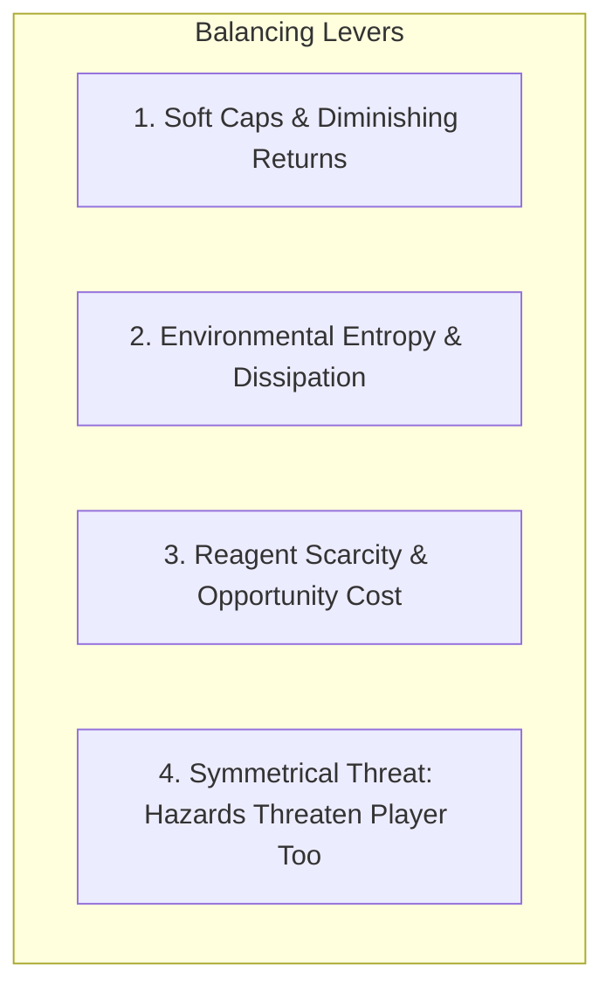

# Chapter 14: Balancing Emergent Systems

> *"Given the opportunity, players will optimize the fun out of a game. Therefore, the designer's job is to protect the player from themselves."*  
> — Soren Johnson & Sid Meier

---

## 14.1 The Combinatorial Balancing Dilemma

In a linear RPG, balancing an encounter is a spreadsheet exercise: adjust Monster HP until average Player Damage per Second requires 4 hits to kill.

In an emergent roguelike, this direct approach collapses:
* If a player uses basic melee, the monster takes 4 hits.
* If a player coats the monster in oil, freezes it, shocks the puddle, and drops a boulder on its head, the monster takes 600 damage in 1 turn.

If you balance monster HP around the basic melee attack, clever systemic play instantly trivializes the entire game. If you balance monster HP around the 600-damage combo, basic melee becomes impossible.



---

## 14.2 Mathematical Levers: Diminishing Returns & Soft Caps

To prevent compounding multipliers from blowing up to infinity, we utilize **Asymptotic Soft Caps**:

$$\text{Effective Damage} = D_{\text{base}} \times \left(1 + \frac{M_{\text{compound}}}{1 + \frac{M_{\text{compound}}}{K}}\right)$$

Where $K$ is the soft-cap threshold (e.g. $K = 3.0$).

```python
def calculate_compounded_damage(base_damage: float, multipliers: list[float], soft_cap: float = 3.0) -> float:
    total_mult = 1.0
    for m in multipliers:
        total_mult *= m

    if total_mult > soft_cap:
        # Asymptotic compression above soft cap
        total_mult = soft_cap + (total_mult - soft_cap) ** 0.5

    return base_damage * total_mult
```

This ensures that clever combinations remain satisfyingly rewarding without breaking the mathematical boundaries of the game.

---

## 14.3 Environmental Entropy and Decay Timers

Unchecked systemic simulations naturally trend toward infinite chaos unless governed by **Entropy and Conservation Laws**:

1. **Combustion Fuel Caps**: Every fire tile consumes 1 unit of `fire_fuel` per tick. Without fresh fuel (oil, wood), fire extinguishes automatically within 5–10 turns.
2. **Gas Dissipation Rates**: Gas clouds lose $\Delta d = 2$ density per turn to ambient atmospheric absorption.
3. **Thermal Relaxation**: Ambient tiles passively decay back toward room temperature ($20^\circ\text{C}$) at a steady rate of $5^\circ\text{C}$ per tick.

```mermaid
graph LR
    EnergySpike[Spike: Fire / Heat / Gas] --> Peak[Peak Interaction]
    Peak -->|Entropy Decay| Ambient[Return to Ambient Equilibrium (20°C)]
```

Entropy guarantees that catastrophic battles leave scars on the dungeon (scorched walls, shattered doors, puddles of water), but restore thermodynamic stability for subsequent exploration.

---

## 14.4 Symmetrical Vulnerability

The ultimate balancing equalizer in traditional roguelikes is **Symmetry**:

> **Rule of Symmetry**: *Any systemic trick the player can inflict on the dungeon, the dungeon can inflict on the player.*

* If water conducts electricity for 30 damage, the player standing in a water puddle is equally vulnerable to an electric shock.
* If dense smoke blinds goblins, it blinds the player too.
* If explosive barrels deal 40 damage, an enemy archer shooting a fire arrow at a barrel next to the player is lethal.

Symmetry transforms powerful emergent mechanics from brainless "win buttons" into intense high-risk, high-reward tactical decisions.
