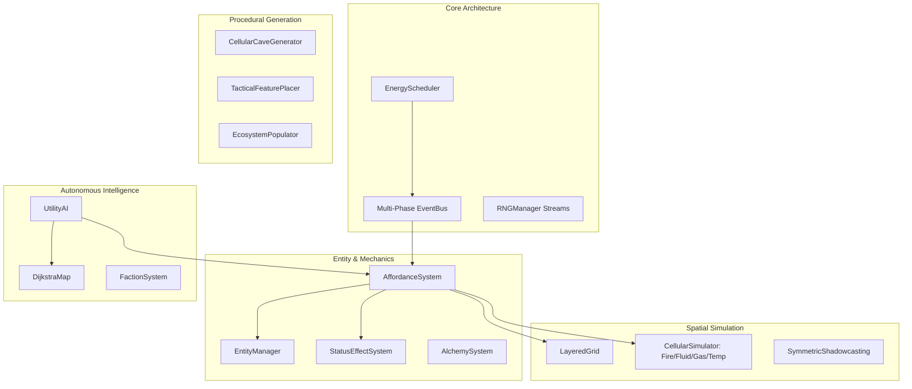

# Chapter 15: Reference Engine Deep Dive & Extension Guide

> *"A well-architected engine is not one where everything is written, but one where new systems can be added without modifying existing code."*

---

## 15.1 Architecture Overview of `pyrogue-emergent`

Throughout this book, we have designed and built a modular reference engine: `pyrogue-emergent`. Below is the complete dependency and communication flow:



---

## 15.2 Step-by-Step Extension Guides

Let us demonstrate the extensibility of this architecture by adding three common roguelike features.

### Recipe 1: Adding a New Elemental Medium — *Cryogenic Frostfire*
Suppose we want to add *Frostfire*: a mystical flame that freezes matter instead of heating it, and solidifies water into blue ice while emitting freezing fog.

1. **Add Enum & Component**:
   ```python
   # In grid.py: Add to GasType
   class GasType(Enum):
       ...
       FREEZING_FOG = auto()
   ```
2. **Add Cellular Rule in `cellular.py`**:
   ```python
   # In CellularSimulator.step():
   if curr.gas_type == GasType.FREEZING_FOG and curr.gas_density > 20:
       nxt.temperature = max(-50, nxt.temperature - 15)
       if nxt.fluid_type == FluidType.WATER:
           nxt.tile = TileType.ICE
           nxt.fluid_type = FluidType.NONE
           logs.append(f"Freezing fog solidified water into ice at ({pos.x}, {pos.y})!")
   ```
3. **No other files need to be touched!** All existing items, creatures, and spells that interact with temperature and ice automatically work with Frostfire.

---

### Recipe 2: Adding a New Affordance Verb — *`Magnetize`*
Suppose we want a spell or wand that magnetizes entities, causing all metallic items and iron-armored creatures to be pulled toward each other.

1. **Add Handler in `affordances.py`**:
   ```python
   def _handle_magnetize(self, event: ActionEvent) -> None:
       origin = event.target_pos
       radius = event.data.get("magnetic_radius", 5)
       
       for entity, (pos, material) in self.ecs.query(Position, Material):
           if material.material_type == MaterialType.IRON:
               dist = origin.chebyshev_dist(pos.pos)
               if 0 < dist <= radius:
                   step = pos.pos.step_towards(origin)
                   self.grid.move_actor(entity.id, pos.pos, step)
                   event.message += f" Iron entity {entity.id} yanked by magnetic force!"
   ```
2. Any entity made of `MaterialType.IRON` (swords, shields, iron golems, bear traps) will now physically fly across the room toward the magnetic pole.

---

## 15.3 The Emergent Designer's Manifesto

As you embark on building your own traditional roguelike or systemic simulation, keep these core principles at the center of your engineering:

1. **Never Hardcode Nouns**: Treat everything as composable properties, materials, and tags.
2. **Simulate Matter, Not Magic**: Magic should feel like an extreme, reality-bending application of physics and chemistry.
3. **Preserve Determinism**: Seed your RNG streams cleanly; test with headless Monte Carlo bots.
4. **Legibility Over Chaos**: Give players the perceptual tools to predict, plan, and understand the beautiful chain reactions they ignite.

May your dungeons be deep, your oil slicks flammable, and your simulations richly alive.
