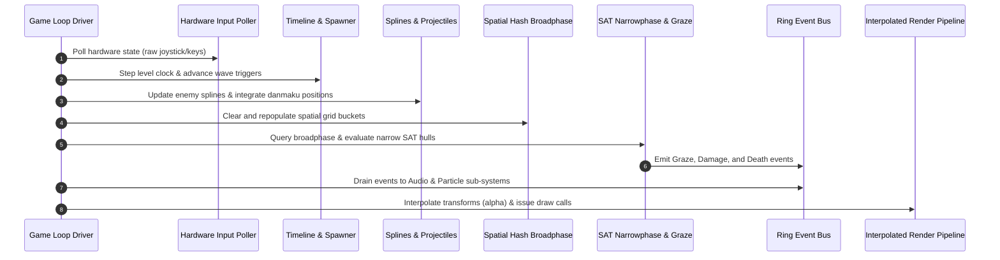

# Chapter 2: Engine Architecture & Core Simulation Loop

In a game where twenty thousand projectiles interact with hundreds of enemy segments every sixteenth of a second, software architecture is not an academic debate—it is the difference between an unplayable slideshow and an electrifying, rock-solid arcade experience.

This chapter establishes the core simulation backbone: deterministic fixed-timestep game loops, cache-conscious Data-Oriented Design (DOD), zero-allocation object pools, and generational handle systems.

---

## 2.1 Deterministic Fixed Timestep Simulation

Variable delta-time loops (`position += velocity * dt`) are disastrous for shmups. They introduce non-deterministic floating-point divergence, frame-rate dependent collision tunneling, and make replay recording mathematically impossible.

A professional shmup simulation must run on a **strict, deterministic fixed timestep** ($\Delta t_{\text{fixed}}$, typically $\frac{1}{60}\text{ s} \approx 16.666\text{ ms}$ or $\frac{1}{120}\text{ s} \approx 8.333\text{ ms}$).

```
                   Wall-Clock Frame Time (Variable dt)
          ┌────────────────────────────────────────────────────────┐
          │                  Accumulator += dt                     │
          └───────────────────────────┬────────────────────────────┘
                                      │
                 ┌────────────────────┴────────────────────┐
                 ▼                                         ▼
     While Accumulator >= dt_fixed             Accumulator < dt_fixed
┌────────────────────────────────────────┐                 │
│  1. Capture Previous State (for lerp)  │                 │
│  2. Consume Fixed Tick (Accum -= dt)   │                 │
│  3. Execute Simulation Systems:        │                 │
│     - Input / Timelines                │                 │
│     - Kinematics & Danmaku Emitters    │                 │
│     - Spatial Partitioning             │                 │
│     - Collision Resolution             │                 │
└────────────────────────────────────────┘                 │
                 ▲                                         │
                 └────────────────────┬────────────────────┘
                                      │
                                      ▼
                      Alpha = Accumulator / dt_fixed
                      Render State = Lerp(PrevState, CurrState, Alpha)
```

### The Accumulator Algorithm & Spiral-of-Death Protection

If the CPU encounters a sudden heavy workload (e.g., OS background task), `frame_time` spikes. If unhandled, the while-loop attempts to simulate dozens of ticks in a single frame, which consumes even more CPU time, causing `frame_time` to grow further in a catastrophic feedback loop known as the **Spiral of Death**.

We solve this by clamping the maximum elapsed delta-time per frame:

```rust
// Pseudocode: Deterministic Fixed Timestep Loop with Accumulator Clamp
struct TimeState {
    fixed_delta: f64,       // e.g., 1.0 / 60.0 (0.0166667s)
    max_frame_time: f64,    // Clamp to e.g. 0.10s (max 6 catch-up ticks)
    accumulator: f64,
    current_time: f64,
}

fn run_frame(time_state: &mut TimeState, engine: &mut Engine) {
    let new_time = get_high_resolution_time();
    let mut frame_time = new_time - time_state.current_time;
    time_state.current_time = new_time;

    // Prevent Spiral of Death by clamping frame_time
    if frame_time > time_state.max_frame_time {
        frame_time = time_state.max_frame_time;
    }

    time_state.accumulator += frame_time;

    // Execute discrete simulation ticks
    while time_state.accumulator >= time_state.fixed_delta {
        engine.snapshot_previous_transforms(); // Save state for render interpolation
        engine.fixed_update(time_state.fixed_delta);
        time_state.accumulator -= time_state.fixed_delta;
    }

    // Calculate sub-frame blend factor for butter-smooth rendering
    let alpha = (time_state.accumulator / time_state.fixed_delta) as f32;
    engine.render(alpha);
}
```

### State Interpolation for Variable Refresh Rates (144Hz / 240Hz Monitors)
When running a $60\text{ Hz}$ simulation on a $144\text{ Hz}$ or $240\text{ Hz}$ monitor, the renderer will execute multiple times between simulation ticks. Without interpolation, entities appear to stutter.

For any visual entity, we blend between its previous tick transform and current tick transform using $\alpha \in [0.0, 1.0)$:

$$\vec{P}_{\text{render}} = (1 - \alpha)\vec{P}_{\text{prev}} + \alpha \vec{P}_{\text{curr}}$$

$$\theta_{\text{render}} = \text{slerp}(\theta_{\text{prev}}, \theta_{\text{curr}}, \alpha)$$

---

## 2.2 Architectural Paradigms: OOP vs. DOD vs. ECS

### Why Traditional Object-Oriented Polymorphism Fails
In traditional OOP, one might model bullets as an inheritance hierarchy:

```
[Traditional OOP Anti-Pattern]
Entity (Virtual Table Pointer: 8 bytes)
  └── Projectile (Virtual Table Pointer: 8 bytes)
        ├── EnemyBullet (Scattered across heap)
        └── LaserBeam (Scattered across heap)
```

Iterating over $30,000$ pointers to polymorphic `Entity*` objects induces:
1. **Cache Miss Hell**: Each bullet is allocated at an arbitrary heap address. The CPU's L1 cache line ($64\text{ bytes}$) is loaded, one pointer dereference occurs, and the rest of the cache line is wasted.
2. **Virtual Method Call Overhead**: Calling `virtual void update(dt)` disables compiler inlining and forces branch predictor stalls on indirect function pointers.

### Data-Oriented Design (DOD) & Structure of Arrays (SoA)
Modern processors can stream contiguous memory through SIMD vector units at over $50\text{ GB/sec}$. To leverage this, we transform our memory layout from **Array of Structures (AoS)** to **Structure of Arrays (SoA)**.

```
AoS (Array of Structures) - Cache Inefficient for Position Updates:
[ Pos.x, Pos.y, Vel.x, Vel.y, Radius, Color, SpriteID, Grazed, Lifetime ] -> [ Pos.x, Pos.y ... ]
  └─────────────── 48 Bytes (Only 16 bytes needed for movement) ───────────┘

SoA (Structure of Arrays) - 100% Cache Line Utilization:
Positions X: [ x0, x1, x2, x3, x4, x5, x6, x7, x8, x9 ... ]  <-- 16 floats fit in a single 64B cache line
Positions Y: [ y0, y1, y2, y3, y4, y5, y6, y7, y8, y9 ... ]
Velocities X:[ vx0, vx1, vx2, vx3, vx4, vx5, vx6 ... ]
Velocities Y:[ vy0, vy1, vy2, vy3, vy4, vy5, vy6 ... ]
```

### ECS Component Splitting for High-Density Danmaku
In a pure Entity Component System (or an archetype-based ECS such as Flecs or Bevy), components are split into dense, packed arrays:

```rust
// Projectile System Data Layout in SoA Format
struct ProjectilePool {
    capacity: usize,
    count: usize,
    
    // Contiguous parallel arrays aligned to 64-byte boundaries
    pos_x: Array<f32>,
    pos_y: Array<f32>,
    vel_x: Array<f32>,
    vel_y: Array<f32>,
    radius: Array<f32>,
    flags: Array<u8>,       // Bitfield: [Active:1, Grazed:1, Polar:1, Homing:1]
    sprite_id: Array<u16>,
    lifetime: Array<f32>,
}

fn update_projectiles(pool: &mut ProjectilePool, dt: f32) {
    let n = pool.count;
    // Compiles directly to AVX-512 / NEON vector instructions
    for i in 0..n {
        pool.pos_x[i] += pool.vel_x[i] * dt;
        pool.pos_y[i] += pool.vel_y[i] * dt;
        pool.lifetime[i] -= dt;
    }
}
```

---

## 2.3 High-Velocity Object Pooling & Generational Indices

In a shmup, thousands of bullets and particles spawn and despawn every second. We cannot call `malloc` or `free`. We pre-allocate all entity buffers at initialization and manage them using an $O(1)$ **In-Place Singly-Linked Free List**.

```
INITIAL PRE-ALLOCATED BUFFER (All Slots Free):
Index:     [ 0 ]   [ 1 ]   [ 2 ]   [ 3 ]   [ 4 ]
NextFree:    1       2       3       4     NONE (-1)
FreeHead ──> 0

AFTER ALLOCATING 2 BULLETS (Slots 0 and 1 occupied):
Index:     [ 0:ACTIVE ]   [ 1:ACTIVE ]   [ 2:FREE ]   [ 3:FREE ]   [ 4:FREE ]
FreeHead ──────────────────────────────────> 2

AFTER DESPAWNING BULLET AT INDEX 0 (0 re-linked to head):
Index:     [ 0:FREE ]     [ 1:ACTIVE ]   [ 2:FREE ]   [ 3:FREE ]   [ 4:FREE ]
NextFree:    2                               3           4        NONE
FreeHead ──> 0
```

### The Stale Reference Bug and Generational Handles
If an enemy locks onto a projectile or another entity by storing a raw array index `idx = 4`, and that projectile dies on frame 100, slot `4` may be recycled on frame 101 for an entirely different entity. The enemy would now be tracking the wrong entity!

We solve this using **Generational Handles** (also known as a **Slot Map**).

```
Handle = (Index: u32, Generation: u32)
```

```rust
// Generational Handle SlotMap Architecture
struct Slot<T> {
    data: T,
    generation: u32,
    is_alive: bool,
    next_free: u32,
}

struct GenerationalPool<T> {
    slots: Array<Slot<T>>,
    free_head: u32,
    active_count: u32,
    capacity: u32,
}

struct EntityHandle {
    index: u32,
    generation: u32,
}

impl<T> GenerationalPool<T> {
    fn allocate(&mut self, initial_data: T) -> Result<EntityHandle, OutOfMemoryError> {
        if self.free_head == INVALID_INDEX {
            return Err(OutOfMemoryError);
        }
        
        let slot_idx = self.free_head;
        let slot = &mut self.slots[slot_idx];
        
        self.free_head = slot.next_free;
        slot.data = initial_data;
        slot.is_alive = true;
        self.active_count += 1;

        Ok(EntityHandle {
            index: slot_idx,
            generation: slot.generation,
        })
    }

    fn free(&mut self, handle: EntityHandle) -> bool {
        let slot = &mut self.slots[handle.index];
        
        // Validate handle generation against slot generation
        if !slot.is_alive || slot.generation != handle.generation {
            return false; // Stale handle reference! Safely ignore.
        }

        slot.is_alive = false;
        slot.generation += 1; // Invalidate all existing handles to this slot
        slot.next_free = self.free_head;
        self.free_head = handle.index;
        self.active_count -= 1;
        
        true
    }

    fn get(&self, handle: EntityHandle) -> Option<&T> {
        let slot = &self.slots[handle.index];
        if slot.is_alive && slot.generation == handle.generation {
            Some(&slot.data)
        } else {
            None // Stale or dead entity
        }
    }
}
```

---

## 2.4 Decoupled Event Dispatching and Systems Bus

Gameplay systems (such as enemy health systems) should never directly call sound players, particle spawners, or score popups. Doing so creates tight coupling and ruins deterministic simulation replay.

Instead, simulation systems push lightweight, flat event structs into a pre-allocated **Ring-Buffered Event Queue**. Non-deterministic or side-effect systems (Audio Engine, VFX Manager, HUD Renderers) drain these events at the end of the frame.

```
SIMULATION PHASE (Deterministic):
┌─────────────────────────┐
│ Enemy Hurt System       │ ───► Push Event: EnemyKilled { id: 42, pos: (120, 300), score: 5000 }
└─────────────────────────┘
┌─────────────────────────┐
│ Graze System            │ ───► Push Event: PlayerGrazed { bullet_id: 104, pos: (240, 500) }
└─────────────────────────┘
            │
            ▼
┌───────────────────────────────────────────────────────────────┐
│              FLAT EVENT RING BUFFER (Pre-allocated)           │
└───────────────────────────────────────────────────────────────┘
            │
            ├───────────────────────┼───────────────────────────┐
            ▼                       ▼                           ▼
┌───────────────────────┐ ┌───────────────────┐ ┌───────────────────────┐
│ Audio Mixer System    │ │ Particle Emitter  │ │ Score & HUD System    │
│ (Triggers Explosion)  │ │ (Spawns Debris)   │ │ (Displays "+5000")    │
└───────────────────────┘ └───────────────────┘ └───────────────────────┘
```

```rust
// Low-overhead Ring-Buffered Event Queue
enum GameEvent {
    EnemyDestroyed { entity_id: u32, position: Vec2, score_value: u32, enemy_type: u16 },
    BulletGrazed { player_id: u8, bullet_pos: Vec2 },
    PlayerDied { player_id: u8, death_pos: Vec2 },
    BombActivated { player_id: u8, screen_pos: Vec2 },
}

struct EventBus {
    buffer: Array<GameEvent, 2048>, // Pre-allocated fixed capacity
    write_head: usize,
    count: usize,
}

impl EventBus {
    fn publish(&mut self, event: GameEvent) {
        if self.count < 2048 {
            self.buffer[self.write_head] = event;
            self.write_head = (self.write_head + 1) % 2048;
            self.count += 1;
        }
    }

    fn drain<F>(&mut self, mut handler: F) where F: FnMut(GameEvent) {
        let read_start = (self.write_head + 2048 - self.count) % 2048;
        for i in 0..self.count {
            let idx = (read_start + i) % 2048;
            handler(self.buffer[idx]);
        }
        self.count = 0;
    }
}
```

---

## 2.5 Frame Execution Lifecycle

The complete execution lifecycle for a single simulation frame is summarized in the following sequence:



With our deterministic loop, zero-allocation memory pools, and decoupled event dispatch in place, we proceed to **[Chapter 3](file:///D:/Playing/coding-agent-experiments/antigravity-shmup-book/book/ch03_spatial_partitioning_and_collision.md)** to tackle the central computational bottleneck: high-performance spatial partitioning and collision queries.
